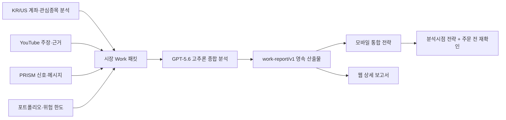

# 통합 투자 전략 파이프라인

## 목표

이 파이프라인의 사용자 산출물은 단순 종목 분석 목록이 아니라 다음 질문에 답하는 하나의 일일 전략이어야 한다.

- 오늘 보유종목 중 무엇을 유지·추가·축소·매도할 것인가?
- 관심종목 또는 신규 후보는 어떤 **정확한 조건**에서 얼마만큼 매수할 것인가?
- 어떤 가격·거래량·이벤트가 논리를 무효화하고, 그때 무엇을 할 것인가?
- KR/US 시장 분석과 YouTube·PRISM 근거가 결론을 어떻게 바꿨는가?
- 분석 시점의 전략과 주문 직전 실시간 확인 상태는 각각 무엇인가?

## 기존 결함

기존 구현은 KR/US Work 입력 패킷과 ACK는 보존했지만 모델이 작성한 최종 보고서 본문은 저장하지 않았다. Pages와 모바일은 원래 decision bundle만 읽었기 때문에 ChatGPT Work에서 한 종합 판단을 보여줄 수 없었다.

또한 한 행의 `row_mode`에 중기 투자 논리와 30분짜리 시세 유효성을 함께 넣었다. Work가 늦게 시작하면 정상적인 BUY/HOLD/REDUCE 논리까지 `BLOCKED_STALE`로 바뀌고 보고서는 “현재 실행 가능 없음” 목록으로 채워졌다.

YouTube는 시장 포트폴리오 파이프라인에 직접 연결되지 않았고 PRISM은 낮은 advisory 보정에만 쓰였다. 시장 Work 패킷도 관련도와 무관한 소수의 최신 이벤트만 잘라 넣었다.

## 정본 흐름

1. scheduled producer는 계좌 보유종목, 관심종목, 신규 후보 전수의 분석과 포트폴리오 제약을 archive에 쓴다.
2. YouTube와 PRISM은 최신순 top-N만 고르는 대신 보유→관심→탐색 종목 round-robin과 시장·종목 관련도를 사용하고, 전송 event key와 잘림 coverage를 receipt로 기록한다.
3. 로컬 Work 자동화가 immutable event를 준비하고 강한 모델로 한국어 투자자 보고서를 작성한다.
4. `publish` 단계가 event id와 source SHA-256을 대조한 뒤 보고서를 `archive/work-reports/<surface>/latest.json`과 content-addressed 이력에 저장한다.
5. 시장 보고서는 publish가 성공해야 ACK할 수 있다. 따라서 “처리 완료” receipt가 있는데 본문이 없는 상태를 만들지 않는다.
6. 다음 Pages build가 최신 보고서를 `mobile/strategy.json`과 웹 화면에 포함한다.

## 전략과 실행 상태 분리

### `thesis`

분석 시점에 유효한 비교적 안정적인 판단이다.

- `stance`: `BUY`, `HOLD`, `REDUCE`, `SELL`, `AVOID`, `RESEARCH`
- `analysis_asof`
- 진입·추가 조건
- 축소·매도 조건
- 무효화·손절 조건과 그 조건 발생 시 축소·정리·보류·재분석 행동
- 근거, 반대 근거, 확신도, 목표 기간

시세 TTL이 지났다는 이유만으로 이 객체를 삭제하거나 `DATA_CHECK`로 덮어쓰지 않는다.

### `execution`

주문 직전의 짧은 유효기간을 가진 상태다.

- `READY_NOW`
- `WAIT_FOR_TRIGGER`
- `NEEDS_LIVE_RECHECK`
- `MARKET_CLOSED`
- `DATA_OUTAGE`

시세가 만료되면 `execution.readiness`만 `NEEDS_LIVE_RECHECK`로 낮춘다. 사용자 화면은 내부 코드 `BLOCKED_STALE` 대신 “분석시점 전략은 유효, 주문 전 현재가·호가 재확인”을 한 번만 표시한다.

## 외부 신호 신뢰 정책

`balanced_external`은 “미검증이므로 무시”도 아니고 “검증 없이 바로 주문”도 아니다.

- YouTube·PRISM은 종목 우선순위, 방향 확신도, 초기 비중 상한, 관찰·회피 판단, 추가 검증 순서를 **실질적으로 변경할 수 있다**.
- 두 외부 원천이 시장·기업 분석과 같은 방향이고 최신성이 충분하면 통합 보고서에서 강한 보강 근거로 취급한다.
- 충돌하면 어느 근거가 무엇과 충돌하는지 표시하고 비중 또는 확신도를 낮춘다.
- ASR 불확실, 출처 불명, 오래된 메시지는 영향도를 낮추되 숨기지 않는다.
- 외부 신호 단독으로 KIS 시세·시장경보·포트폴리오 한도·손실 제한 gate를 우회할 수 없다.
- 각 추천에는 가능한 경우 `MARKET`, `YOUTUBE`, `PRISM`의 기여와 충돌을 표시한다.

향후에는 추천 시점의 신호와 1일·5일·20일 사후성과를 저장해 원천·채널·발신자별 가중치를 보정한다. “어느 정도 검증됐다고 가정”하는 현재 정책을 영구적인 무검증 고정값으로 만들지 않기 위함이다.

## 모바일 정보 구조

첫 화면은 다음 순서로 구성한다.

1. 분석 시점과 실시간 재확인 상태
2. 오늘의 최우선 행동 3개
3. 보유종목: 유지·추가·축소·매도
4. 관심종목과 신규 매수 후보
5. 각 카드의 `왜`, `진입 조건`, `조건 충족 시 행동`, `무효화/손절`, `금액·비중`, `기간`
6. YouTube·PRISM 기여 요약
7. 모델이 작성한 통합 종합 분석 전문

“조건 충족 시”에는 행동명만 반복하지 않고 실제 가격·거래량·이벤트 조건을 표시한다. `trigger_conditions`와 `action_if_triggered`는 서로 다른 필드로 유지한다.

## 개인정보와 공개 범위

사용자 요청에 따라 모바일 전략은 암호화 키 없이 직접 열리는 plaintext Pages 산출물로 게시한다. 대신 계좌번호, 고객 식별자, 인증 토큰, 주문번호와 원시 계좌 파일은 계속 제거한다. 공개되는 범위는 종목, 전략, 조건, 제안 비중·금액 등 투자 행동 정보다.

## 알림 정책

Telegram 즉시 알림은 사용자가 대응해야 할 사건에 한정한다.

- 즉시: 인증 실패, 핵심 보유종목 coverage 누락, daily full 최종 마감 미생성, 데이터 무결성 실패, 최종 배포 실패
- 억제/대시보드만: 새 비보유 PRISM·scanner 후보가 baseline에 없는 경우, 증명된 gate no-work·superseded deploy, cooldown 안의 동일 원인 반복
- 동일 장애는 workflow run id가 아니라 workflow/profile/stage/정규화 원인/baseline SHA fingerprint로 묶고 cooldown을 적용한다.
- 새 원인의 최초 실패는 recovery 출처와 무관하게 알리고, 동일 원인의 반복만 마지막 실제 전송부터 6시간 동안 억제한다.

## 완료 기준

- 계좌 보유종목과 관심종목의 생산 coverage가 모두 receipt에 기록된다.
- 모든 카드에 실제 조건, 무효화/위험 조건, 무효화 시 행동이 있다.
- 모델 최종 보고서가 source event와 결합되어 archive에 남는다.
- 모바일에서 raw `BLOCKED_STALE`과 “현재 실행 가능 없음” 반복 문구가 보이지 않는다.
- YouTube·PRISM 기여가 보고서에 명시된다.
- `mobile/private.html`은 키 없이 열리고, `private.enc.json`과 암호화 secret 의존성이 없다.
- Pages snapshot 검증이 `mobile/strategy.json`의 schema와 계좌 식별자 부재를 확인한다.
