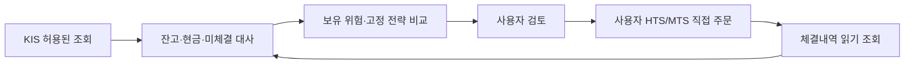

# 실계좌 기준 전략 재설계와 검증 결과

작성일: 2026-09-22. 운용 선호: **기존 자금, 차입·레버리지 없음, 수익률과 손실폭의 균형**. 모의투자는 선행 조건에서 제외한다. 실계좌 자료의 자동 조회·분석과 사용자의 HTS/MTS 직접 주문을 결합한다. 자율적인 실계좌 주문 전송 기능은 이 설계의 구현 범위에 없다.

## 결정

**현재 선택은 저회전율 분산 배분을 기본 비교안으로 두고, 추세·변동성 조절을 추가 검증하는 구조다.** 80% 광범위 주가지수·20% 같은 통화의 현금은 연구 기준이며, 기존 종목의 일괄 매도나 계좌 비중 자동 변경 지시가 아니다. 개인의 투자기간과 허용 낙폭이 정해지지 않았으므로 미래 수익률을 극대화할 단일 전략이 확정되었다고 표현하지 않는다.

“WAIT가 많다”는 현상과 “위험을 거의 부담하지 않는다”는 상태를 구분한다. 이미 주식을 보유한 계좌의 WAIT는 보유 위험을 유지한다. 개선의 목적은 거래 건수 확대가 아니라 비용 후 성과와 감수하는 위험을 함께 개선하는 것이다. 기존 보유 유지, 광범위 지수 보유, 저회전율 배분이 모든 복잡한 전략의 기준선이다.

기존 보유분의 정확한 과거 가상 운용 수익은 당시 보유 수량·실행가능 가격·입출금·체결·세금 자료로 재구성해야 한다. 현재 살아남은 종목과 현재 수량을 과거에 소급한 수익을 이전 리포트의 실적이라고 보고하지 않는다. 과거 감사 결과와 새 고정 전략 실험은 별도 증거다.

## 외부 근거를 어떻게 적용했는가

| 근거 | 판단과 적용 |
|---|---|
| [SEC 자산배분·분산](https://www.investor.gov/additional-resources/general-resources/publications-research/info-sheets/beginners-guide-asset), [Vanguard 리밸런싱](https://investor.vanguard.com/investor-resources-education/portfolio-management/rebalancing-your-portfolio) | 배분은 투자기간과 손실 감내도에 맞춘다. 리밸런싱은 위험배분 유지 수단이며 초과수익 보장이 아니다. 현금·배당을 우선 활용하는 낮은 회전율을 비교한다. |
| [AQR 장기 추세 연구](https://www.aqr.com/insights/research/journal-article/a-century-of-evidence-on-trend-following-investing) | 선물·통화·롱숏을 포함한 연구 결과를 무레버리지 현금 ETF 계좌에 그대로 이식하지 않는다. 변형한 월간 규칙은 별도 실험한다. |
| [Daniel–Moskowitz 모멘텀 급락](https://www.nber.org/papers/w20439) | 급반전에서 모멘텀 실패가 가능하다. 원 논문의 롱숏 손실 크기를 현금 계좌에 그대로 대입하지 않는다. |
| [Moreira–Muir 변동성 조절](https://www.nber.org/papers/w22208), [Cederburg 외 반증](https://www.lehigh.edu/~xuy219/research/COWY.pdf) | 긍정 결과와 103개 전략의 비체계적 우월성·실시간 구현 한계를 함께 검토했다. 변동성 상한은 후보이며 자동 기본값이 아니다. |
| [백테스트 과적합](https://www.davidhbailey.com/dhbpapers/backtest-prob.pdf) | 결과를 보고 최상 파라미터를 고르는 절차를 피하고 고정 후보 전체 결과·설정 해시를 남긴다. 이번 비교는 미사용 검증 구간 실험이 아니라 후향 민감도 분석이다. |

외부 프로젝트의 운용 원칙도 재검토했다. [NautilusTrader 대사](https://nautilustrader.io/docs/latest/concepts/execution/reconciliation/)와 [QuantConnect 실거래 대사](https://www.quantconnect.com/docs/v2/cloud-platform/live-trading/reconciliation)는 내부 예상과 증권사 실제 상태의 불일치를 다루는 참조다. 이번 코드에서는 미체결 0건을 “전체 조회 완료”로 승격하지 않고 확인 불가로 표시한다. 기존 모의 주문 전송기를 실계좌용으로 변환하지 않는다.

[Freqtrade 미래정보 검사](https://www.freqtrade.io/en/stable/lookahead-analysis/)의 원칙을 적용해 전체 자료와 잘린 자료의 과거 신호가 같은지 검증한다. [Backtrader 주문](https://www.backtrader.com/docu/order/)과 [QuantConnect 슬리피지](https://www.quantconnect.com/docs/v2/writing-algorithms/reality-modeling/slippage/key-concepts)는 신호와 실제 체결 가격의 차이를 설명하는 참조다. 새 실험은 완료된 월 데이터 → 다음 시가, 추가 1거래일 지연, 비용 3수준을 비교한다.

[KIS 공식 프로젝트](https://github.com/koreainvestment/open-trading-api)의 API 예제·backtester·strategy_builder는 검증할 수 있는 입력 규격과 비교 도구로 활용한다. [Qlib](https://github.com/microsoft/qlib), [FinRL](https://github.com/AI4Finance-Foundation/FinRL), [vectorbt](https://vectorbt.dev/)를 설치하는 것 자체는 수익 우위의 증거가 아니다. 현 단계에서는 실시간 자료·정수 수량·세금·전환 비용을 검증하기 전에 학습 모델과 최적화 탐색을 확대하지 않는다. 이전 세부 조사는 [외부 프로젝트 조사](external_trading_review_20260922_ko.md)에 남아 있다.

## 고정 후보와 실험 조건

| 후보 | 규칙 | 비용·실패 가능성 |
|---|---|---|
| 단순 보유 | 첫 실행 가능 시가에 광범위 지수 100%, 이후 보유 | 높은 주식 노출과 시장 낙폭 |
| 80/20 | 주식 80%·현금 20%, 분기 첫 거래일에 전일 종가 비중이 목표에서 5%p 이상 벗어났을 때 조정 | 상승장에서 현금 기회비용. 조정 사이에는 비중이 변동 |
| 월간 추세 | 직전 완료 월 종가가 완료된 10개월 종가 평균보다 높으면 주식 80%, 아니면 현금 | 횡보·급반등 시 전환 비용과 기회비용 |
| 추세+변동성 상한 | 위 조건에서 주식 목표 `min(80%, 10% / 최근 60거래일 연율화 변동성)` | 급락 후 재진입 지연. 상한은 월간 조정 목표이며 매 순간 강제되는 손실 한도가 아님 |

가격은 로컬에서 보관한 Yahoo Finance 조정 OHLC 캐시다. SPY와 069500.KS를 각 시장의 관측 거래일로 분리한다. 2020–2023, 2024–2026-09-18 연속 기간 및 2020~2026 독립 연도, 편도 비용 10/30/100bp, 기본 다음 시가와 추가 1거래일 지연을 조합한다. **108개 동일 조건 비교, 432개 전략 실행**을 저장했다. 각 기간은 현금 100,000 단위로 독립 초기화한다. 독립 연도 결과를 곱해 연속 실적으로 만들지 않는다.

현재 결과는 조정가격의 분수 단위·현금이자 0%·세전·환율 제외다. 실제 1주 수량, 기존 종목을 팔고 새 전략으로 전환하는 비용, 미결제 자금, 실제 호가차, 실현 양도소득세를 재현하지 않는다. 편도 비용은 계좌 실측치가 아닌 가정이다. 결과를 실계좌 예상수익으로 환산하지 않는다. 마지막 보유분은 평가만 하고 매도하지 않아 종료 청산 비용도 없다.

## 결과: 미국 광범위 지수

편도 비용 **30bp**, 추가 지연 없음. 표의 숫자는 **누적수익 / 최대낙폭**이다. 30bp는 편도 0.30%이며 사용자의 실제 요율이라는 뜻이 아니다.

| 후보 | 2020–2023 | 2024–2026-09-18 | 2022년 독립 실험 | 2026년~09-18 독립 실험 |
|---|---:|---:|---:|---:|
| 단순 보유 | +55.98% / -33.72% | +66.10% / -18.76% | -18.65% / -24.50% | +11.61% / -8.88% |
| 80/20 | +44.54% / -27.21% | +51.77% / -15.76% | -14.93% / -19.61% | +9.30% / -7.13% |
| 월간 추세 | +18.90% / -22.10% | +32.00% / -8.08% | -18.86% / -19.83% | +0.50% / -7.14% |
| 추세+변동성 상한 | +14.04% / -14.92% | +26.63% / -7.40% | -12.54% / -13.01% | -0.25% / -7.13% |

새 추세 규칙은 최근 구간의 낙폭을 크게 줄였지만 수익도 상당히 낮췄다. 2022년에는 월간 추세의 손실이 단순 보유보다 조금 컸다. 따라서 “추세 규칙을 넣으면 언제나 수익·방어가 개선된다”는 주장은 지지되지 않는다. 80/20은 규칙과 거래가 단순하다는 장점이 있지만 손실이 작은 전략은 아니다. 예를 들어 주식이 일시에 30% 하락하고 현금과 환율이 그대로라면 80% 주식 계좌도 약 24% 감소한다. 이 단순 충격 계산은 최대 손실의 상한이 아니다.

## 한국 자료의 검증 한계

같은 30bp 조건에서 2020–2023의 단순 보유는 +31.50%/-34.64%, 80/20은 +27.79%/-27.93%, 월간 추세는 +33.00%/-11.30%, 추세+변동성은 +13.02%/-10.20%였다. 시장과 시기마다 방어의 효과가 달랐다.

2024–2026-09-18 캐시에서는 단순 보유 +219.00%/-40.81%, 80/20 +172.50%/-33.46%, 추세 +158.21%/-33.06%, 추세+변동성 +59.46%/-10.68%가 계산된다. **이 구간은 공식 일별 가격 검증이 미완료이므로 전략 채택 근거로 확정하지 않는다.** 특히 2026-07-31의 하루 변동이 약 +24.17%다. 두 가격 제공처가 일치했다는 사실만으로 원자료 검증을 완료했다고 보지 않는다.

KRX와 삼성자산운용은 07-31 기준 분배금 183원/좌, 08-04 지급 예정 정보를 공시했다. 이 분배금은 전일 캐시 종가 87,635원의 약 0.209%라 해당 급등 전체를 설명하지 못한다는 것이 이번 검토의 추론이다. 07-30·07-31 공식 종가 및 분할·기준가 변경 유무는 미확인이다. 근거 없이 가격을 삭제·수정하지 않았다. [KRX 원문](https://kind.krx.co.kr/external/2026/07/29/000913/20260729002071/68659.htm), [삼성 공지](https://www.samsungfund.com/etf/lounge/notice-view.do?no=78273)

추가로 규칙을 그대로 두고 급등 전인 2026-07-30에 종료한 민감도 8개를 별도로 저장했다. 한국 단순 보유 +155.80%/-40.81%, 80/20 +131.57%/-33.46%, 추세 +118.69%/-33.06%, 추세+변동성 +55.44%/-10.68%였다. 이는 문제 발견 후 종료일을 정한 진단이며 앞선 가격의 검증을 대신하지 않는다.

## 실계좌 운용 지원 구조



계좌 조회 클라이언트는 인증용 토큰 발급을 제외하면 사전 허용한 GET 경로/TR 조합만 통과한다. 실계좌·모의 환경을 엄격하게 구분하고 리디렉션을 차단한다. 새로운 API는 코드 검토로 허용목록을 변경해야 한다. 명시적인 주문가능 현금 0을 양수 예수금으로 대체하지 않으며, 증권사 순자산에 매수가능금액을 더해 자산을 부풀리지 않는다.

기존 계좌 리포트 생성 시 비공개 디렉터리에 `account_review.json`과 `account_review.md`를 함께 저장한다. 종목 비중, 1주 비중, 고정 현금 하한의 자산 대비 비율, 무거래 시 가격 충격 민감도를 표시한다. 시장별 자산 합계는 통화 원장이 대사되기 전까지 산출하지 않는다. 빈 미체결 목록·유효한 잔고라는 표지만으로 전체 조회 완료를 추정하지 않는다. 오래된 자료·잘못된 통화·누락된 평가액은 확인 필요로 표시한다.

**아직 구현되지 않은 부분:** 통화별 통합 원장 완전 대사, 모든 시장의 미체결 조회 완전성, 공급자 가격 시각 검증, 실제 세후·정수 수량 계좌 전환 시뮬레이션. 현재 검토표는 이를 충족했다고 표시하지 않으며 주문 준비 완료 판정을 만들지 않는다. 신용·통합증거금 설정이나 유료 시세 권한은 변경하지 않았다.

사용자는 기존 KIS 등록 정보를 재사용한다. 모의계좌 개설·키 발급·새 자금 입금은 필요하지 않다. 우선 국내·미국 실제 수수료와 환전 우대/종료일만 확인하면 비용 가정을 줄일 수 있다. 거래를 결정할 때 HTS/MTS에서 실제 주문가능액·정수 수량·지정가·시각을 확인하고 직접 제출한다. 자주 바뀌는 LLM 설명이 사전 고정 배분 규칙을 자동 변경하지 않도록 한다.

## 비용·유료 서비스

[비용·세금·서비스·최소 작업 안내](live_account_costs_sources_ko.md)에 확인일과 공식 링크를 정리했다. 우선순위는 필요한 실시간 시세 범위, 생존편향 없는 연구 데이터, 추가 계산 자원 순이다. KIS 미국 통합시세 공개 요금은 월 $5이나 현재 API까지 같은 권한이 적용되는지 확인이 필요하다. Norgate US Platinum은 연 $630, QuantConnect Researcher 권장 구성은 조사일 월 $84로 확인했다. 구독·결제는 하지 않았다.

예시 자산 4천만원·가정 환율 1,500원에서 세 서비스를 모두 사용하면 연 254.7만원, 자산의 약 6.37%다. 실제 계좌 합산액이나 환율 전망이 아닌 비용 비교 예시다. 이 비용을 감수할 근거 없이 여러 서비스를 한꺼번에 도입하지 않는다.

## 재현과 검증

기존 프로젝트 Python 환경에서 실행한다. 가격 캐시는 직접 생성한 신뢰할 수 있는 로컬 파일만 사용한다. 아래 결과 파일에는 계좌 정보가 들어갈 수 있으므로 비공개 출력 경로를 지정한다.

```powershell
$env:PYTHONPATH = '.'
python tools/review_actual_account.py --archive-root <archive/runs> --output <private-output>
python tools/review_live_account_strategies.py --trusted-price-cache <trusted-etf-prices.pkl> --output <private-output> --include-curves
```

연구 출력에는 원자료·시장별 가격·설정 SHA256, 실행 환경, 모든 후보 결과, 수익/낙폭의 비지배 후보 집합이 포함된다. 비지배 집합은 어느 한 후보가 수익과 낙폭 양쪽에서 다른 후보에 밀리지 않는다는 뜻이며 투자 적합성 판정이 아니다. 기존 계좌의 개인별 검토표와 상세 연구 곡선은 저장소에 커밋하지 않는다.
